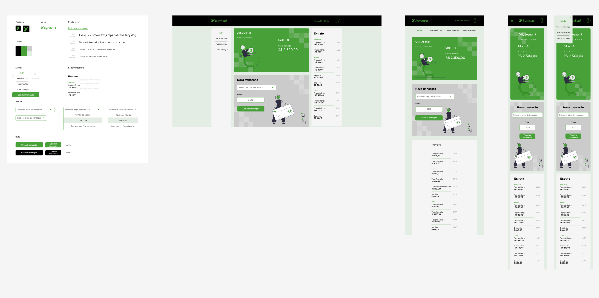

#  React: Avançando em testes e2e com Cypress

Desenvolvido durante o curso avançado de criação de testes end to end para React com Cypress, na Escola de Tecnologia Alura como parte da formação em React.

## Principais Tópicos

- `Boas práticas de organização e escrita de testes no Cypress`
- `Compreender e realizar testes de API utilizando o Cypress`
- `Realizar testes com dados dinâmicos`
- `Escrever testes de jornada de usuários testando a integração de Front-end e Backend juntos`
- `Entender como proteger dados sensíveis`
- `Testar recursos em diferentes tamanhos de tela`

## Bytebank

O Bytebank é uma Start up fictícia utilizada nesse curso da Alura. A ideia principal desse curso é mostrar como escrever e melhorar os testes de ponta a ponta utilizando a ferramenta Cypress.

O Bytebank é uma start up de banco digital criada para desenvolvedores e desenvolvedoras. Atualmente está na fase de desenvolvimento e conforme novas funcionalidades são adicionadas novos testes precisam ser feitos, por isso iremos escrever e melhores os testes de ponta a ponta existente na aplicação utilizando o Cypress.

## 🔨 Funcionalidades do projeto

O projeto encontra-se em uma fase avançada, possuindo algumas páginas e diferentes telas como:

- Página Inicial
- Página Home
  - Tela de Cartões
  - Tela Serviços
  - Tela Investimentos
- Página 404
- Página de minha conta

O [Figma dessa aplicação você encontra aqui](https://www.figma.com/file/YJydxY5H8gf5lPLyKWOBbY?embed_host=notion&kind=&node-id=80%3A199&t=rKQJYFpJUumrCTx1-1&viewer=1).

## ✔️ Técnicas e tecnologias utilizadas

Se liga nessa lista de tudo que usaremos nesse curso:

- `React`
- `Create React App`
- `Cypress`
- `Axios`
- `Faker.js`
- `GitHub`
- `Figma`

E muito mais!

## 🛠️ Abrir e rodar o projeto

Para abrir e rodar o projeto, execute `npm install` para instalar as dependências e `npm start` para inicar a aplicação.

Depois, acesse <a href="http://localhost:3000/">http://localhost:3000/</a> no seu navegador.
